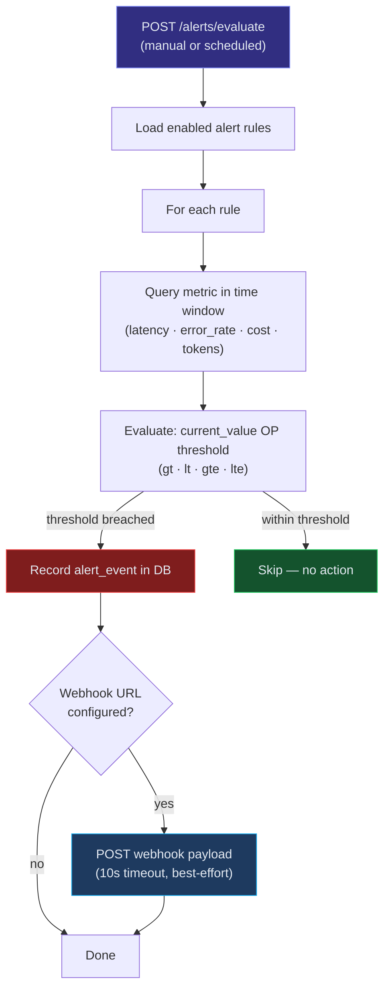
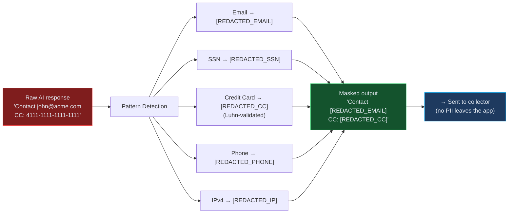

# AI Service Monitor

Production monitoring and observability platform for AI/LLM services. Tracks latency, token usage, cost, errors, and response quality across OpenAI, Anthropic, and custom model providers.

[](https://github.com/gcasti256/ai-service-monitor/actions/workflows/ci.yml)
[](LICENSE)
[](tsconfig.json)
[](package.json)

## Dashboard Preview

```
┌─────────────────────────────────────────────────────────────────────────────────┐
│  AI Service Monitor                                          ⟳ Live │ ● Online │
├─────────────────┬─────────────────┬─────────────────┬───────────────────────────┤
│  Total Calls    │  Avg Latency    │  Error Rate     │  Total Cost               │
│    12,847       │    234ms        │    1.8%         │    $47.32                 │
│  ▲ 12% / 24h   │  ▼ 8% / 24h    │  ─ 0% / 24h    │  ▲ 15% / 24h             │
├─────────────────┴─────────────────┴─────────────────┴───────────────────────────┤
│                                                                                 │
│  Latency (last 24h)                          Cost by Day                        │
│                                                                                 │
│  500ms ┤                 ╭─╮                  $12 ┤   ██                        │
│  400ms ┤          ╭╮    ╭╯ ╰╮                 $10 ┤   ██ ██                     │
│  300ms ┤     ╭╮╭─╯╰──╮╭╯   ╰─╮               $8 ┤██ ██ ██                     │
│  200ms ┤──╮╭╯╰╯      ╰╯      ╰──             $6 ┤██ ██ ██ ██ ██              │
│  100ms ┤  ╰╯                                  $4 ┤██ ██ ██ ██ ██ ██           │
│      0 ┼────┬────┬────┬────┬────              $0 ┼──┬──┬──┬──┬──┬──           │
│        00   06   12   18   Now                   Mon Tue Wed Thu Fri Sat        │
│                                                                                 │
├─────────────────────────────────────────────────────────────────────────────────┤
│  Model Breakdown                                                                │
│  ┌────────────────────┬───────┬─────────┬──────────┬─────────┬────────┐        │
│  │ Model              │ Calls │ Latency │ Tokens   │ Cost    │ Errors │        │
│  ├────────────────────┼───────┼─────────┼──────────┼─────────┼────────┤        │
│  │ gpt-4o             │ 4,231 │  312ms  │ 2.1M     │ $18.45  │  1.2%  │        │
│  │ gpt-4o-mini        │ 6,102 │   89ms  │ 4.8M     │  $2.88  │  0.8%  │        │
│  │ claude-sonnet-4    │ 1,847 │  445ms  │ 1.2M     │ $21.60  │  2.1%  │        │
│  │ claude-haiku-3.5   │   667 │   67ms  │ 0.3M     │  $0.39  │  0.3%  │        │
│  └────────────────────┴───────┴─────────┴──────────┴─────────┴────────┘        │
└─────────────────────────────────────────────────────────────────────────────────┘
```

## Features

- **Lightweight SDK** — Drop-in wrapper for OpenAI and Anthropic SDK calls with zero overhead to AI requests
- **Automatic Telemetry** — Captures latency, token counts, cost estimates, and error details without code changes
- **PII Masking** — Built-in detection and redaction of emails, phone numbers, SSNs, and credit card numbers
- **Trace Propagation** — Correlate multi-step agent flows with trace IDs and parent span references
- **Real-time Dashboard** — Overview metrics, latency charts, cost analytics, model comparison, and error logs
- **Configurable Alerts** — Set thresholds on latency, error rate, cost, or token usage with webhook notifications
- **Data Retention** — Automatic cleanup of old telemetry data with configurable retention periods
- **Docker Ready** — Full Docker Compose setup with health checks for production deployment

## Architecture

### Data Flow


### Alert Evaluation Pipeline



### PII Masking Flow



### Monorepo Structure

```
ai-service-monitor/
├── packages/
│   ├── sdk/            # @ai-monitor/sdk — zero-dependency monitoring wrapper
│   ├── server/         # @ai-monitor/server — collector API + alert engine
│   └── dashboard/      # @ai-monitor/dashboard — React 19 real-time UI
├── examples/           # Runnable integration scripts
├── docker-compose.yml
├── Dockerfile          # Multi-stage: server + dashboard images
└── .github/workflows/ci.yml
```

## Tech Stack

| Layer | Technology |
|-------|-----------|
| SDK | TypeScript, async batching transport, zero runtime dependencies |
| API Server | Hono, better-sqlite3 (WAL mode), Zod validation |
| Dashboard | React 19, Vite 6, Tailwind CSS v4, Recharts |
| Testing | Vitest (unit, integration, E2E) |
| Infrastructure | Docker, Docker Compose, GitHub Actions CI/CD |

## Quick Start

### Prerequisites

- Node.js >= 20
- npm >= 10

### Installation

```bash
git clone https://github.com/gcasti256/ai-service-monitor.git
cd ai-service-monitor
npm install
```

### Development

```bash
# Start both server and dashboard
npm run dev

# Or start individually
npm run dev:server    # API on http://localhost:3100
npm run dev:dashboard # UI on http://localhost:5173
```

### Seed Demo Data

```bash
cd packages/server
npx tsx src/seed.ts
```

Generates 600+ traces over the last 7 days with realistic data across multiple models.

## Quick Demo

### Health Check

```bash
curl http://localhost:3100/health
```

```json
{
  "status": "ok",
  "timestamp": "2025-01-15T14:30:00.000Z"
}
```

### Ingest a Trace

```bash
curl -X POST http://localhost:3100/traces \
  -H "Content-Type: application/json" \
  -d '{
    "traceId": "abc-123",
    "spanId": "span-1",
    "timestamp": "2025-01-15T14:30:00.000Z",
    "duration": 234,
    "provider": "openai",
    "model": "gpt-4o",
    "endpoint": "/chat/completions",
    "status": "success",
    "tokens": { "input": 150, "output": 80, "total": 230 },
    "cost": { "input": 0.000375, "output": 0.0006, "total": 0.000975 }
  }'
```

```json
{ "ingested": 1 }
```

### Query Dashboard Stats

```bash
curl http://localhost:3100/stats
```

```json
{
  "total_calls": 12847,
  "avg_latency": 234.56,
  "error_rate": 1.82,
  "total_cost": 47.32,
  "total_tokens": 8423150,
  "period_start": "2025-01-08T06:12:00.000Z",
  "period_end": "2025-01-15T14:30:00.000Z"
}
```

### Create an Alert Rule

```bash
curl -X POST http://localhost:3100/alerts/rules \
  -H "Content-Type: application/json" \
  -d '{
    "name": "High Latency Warning",
    "metric": "latency",
    "operator": "gt",
    "threshold": 2000,
    "windowMinutes": 15
  }'
```

```json
{
  "id": "a1b2c3d4-...",
  "name": "High Latency Warning",
  "metric": "latency",
  "operator": "gt",
  "threshold": 2000,
  "window_minutes": 15,
  "enabled": 1
}
```

### Evaluate Alerts

```bash
curl -X POST http://localhost:3100/alerts/evaluate \
  -H "Content-Type: application/json" -d '{}'
```

```json
{
  "triggered": [
    {
      "id": "evt-...",
      "ruleName": "High Latency Warning",
      "metric": "latency",
      "currentValue": 2345.67,
      "threshold": 2000
    }
  ],
  "count": 1
}
```

## SDK Usage

```typescript
import { AIMonitor } from '@ai-monitor/sdk';
import OpenAI from 'openai';

const monitor = new AIMonitor({
  collectorUrl: 'http://localhost:3100',
  enablePiiMasking: true,
});

const openai = new OpenAI();

// Wrap any AI call — telemetry is captured automatically
const response = await monitor.traceOpenAI('gpt-4o', async () => {
  return openai.chat.completions.create({
    model: 'gpt-4o',
    messages: [{ role: 'user', content: 'Hello' }],
  });
});

// For multi-step agent flows, propagate trace IDs
const traceId = crypto.randomUUID();

const step1 = await monitor.trace('openai', 'gpt-4o', '/chat/completions',
  () => openai.chat.completions.create({ model: 'gpt-4o', messages: [...] }),
  { traceId }
);

const step2 = await monitor.trace('anthropic', 'claude-sonnet-4-20250514', '/messages',
  () => anthropic.messages.create({ model: 'claude-sonnet-4-20250514', messages: [...] }),
  { traceId, parentSpanId: step1.id }
);

// Graceful shutdown flushes all pending events
await monitor.shutdown();
```

See the [`examples/`](./examples/) directory for complete, runnable integration scripts.

## API Endpoints

| Method | Path | Description |
|--------|------|-------------|
| `GET` | `/health` | Health check with liveness probe |
| `POST` | `/traces` | Ingest single trace or batch (array) |
| `GET` | `/traces` | List traces with filters (model, provider, status, date range) |
| `GET` | `/traces/:id` | Get trace by span ID |
| `GET` | `/traces/by-trace/:traceId` | Get all spans in a trace group |
| `GET` | `/stats` | Aggregate dashboard metrics (calls, latency, errors, cost) |
| `GET` | `/stats/latency` | Hourly latency timeseries |
| `GET` | `/stats/models` | Per-model breakdown (calls, latency, tokens, cost, errors) |
| `GET` | `/stats/cost` | Daily cost timeseries |
| `GET` | `/stats/errors` | Error log with pagination |
| `GET` | `/alerts/rules` | List alert rules |
| `POST` | `/alerts/rules` | Create alert rule (with SSRF-safe webhook validation) |
| `PUT` | `/alerts/rules/:id` | Update alert rule |
| `DELETE` | `/alerts/rules/:id` | Delete alert rule |
| `POST` | `/alerts/evaluate` | Evaluate all active rules against current data |
| `GET` | `/alerts/events` | Alert event history |
| `GET` | `/admin/stats` | Database statistics |
| `POST` | `/admin/cleanup` | Trigger retention cleanup |

## Docker Deployment

```bash
# Build and start all services
docker compose up -d

# Dashboard: http://localhost:8080
# API: http://localhost:3100
```

## Kubernetes Deployment

Full Kubernetes manifests and a Helm chart are included for production deployment.

### Quick Deploy with kubectl

```bash
# Create namespace and apply all manifests
kubectl apply -f k8s/namespace.yaml
# Edit k8s/server/secret.yaml with real credentials first!
kubectl apply -f k8s/server/
kubectl apply -f k8s/dashboard/
```

### Deploy with Helm

```bash
# Default
helm install ai-monitor ./helm/ai-service-monitor

# Staging
helm install ai-monitor ./helm/ai-service-monitor \
  -f ./helm/ai-service-monitor/values-staging.yaml

# Production
helm install ai-monitor ./helm/ai-service-monitor \
  -f ./helm/ai-service-monitor/values-production.yaml

# Upgrade an existing release
helm upgrade ai-monitor ./helm/ai-service-monitor \
  -f ./helm/ai-service-monitor/values-production.yaml
```

### What's Included

| Feature | Details |
|---------|---------|
| **HPA** | CPU-based autoscaling (2-10 replicas, 70% target) with scale-down stabilization |
| **Health Probes** | Liveness + readiness probes on `/health` with tuned delays |
| **Security** | `runAsNonRoot`, `readOnlyRootFilesystem`, all capabilities dropped |
| **Anti-affinity** | Pods prefer spreading across nodes for high availability |
| **Rolling Updates** | Zero-downtime deploys (`maxSurge: 1`, `maxUnavailable: 0`) |
| **Ingress** | TLS via cert-manager, nginx rate limiting, CORS headers |
| **Prometheus** | Pod annotations for automatic scrape discovery |

### Environment-Specific Deployments

| Environment | Replicas | CPU Limit | Memory Limit | HPA Max |
|-------------|----------|-----------|--------------|---------|
| Staging | 1 | 300m | 256Mi | 3 |
| Default | 2 | 500m | 512Mi | 10 |
| Production | 3 | 1000m | 1Gi | 20 |

### Monitoring in Kubernetes

Server pods are annotated for Prometheus autodiscovery:

```yaml
annotations:
  prometheus.io/scrape: "true"
  prometheus.io/port: "3100"
  prometheus.io/path: "/health"
```

To set up a Prometheus ServiceMonitor, point it at the `server` service on port `3100`.

See [`k8s/README.md`](k8s/README.md) for raw manifest details and [`helm/ai-service-monitor/README.md`](helm/ai-service-monitor/README.md) for Helm chart configuration.

## Configuration

| Variable | Default | Description |
|----------|---------|-------------|
| `PORT` | `3100` | Server port |
| `HOST` | `0.0.0.0` | Server bind address |
| `DATABASE_PATH` | `./data/monitor.db` | SQLite database path |
| `RETENTION_DAYS` | `30` | Auto-cleanup threshold |
| `API_KEY` | — | Optional Bearer token authentication for write endpoints |
| `VITE_API_URL` | `http://localhost:3100` | Dashboard API base URL |

## Production at Scale

ai-service-monitor is designed as a reference architecture for LLM observability. Here's how each layer maps to enterprise infrastructure:

| Component | Development | Production at Scale |
|-----------|------------|-------------------|
| **Collector API** | Single Hono process + SQLite | Horizontally scaled behind ALB, write to TimescaleDB or ClickHouse |
| **Storage** | SQLite WAL (single node) | TimescaleDB for time-series queries at billion-row scale, or ClickHouse for analytics |
| **SDK Transport** | Async batched fetch | SDK ships as an npm package; batch size and flush interval tuned per-service |
| **Alerting** | Webhook POST | Integration with PagerDuty, OpsGenie, Slack via alert webhooks |
| **Dashboard** | React SPA polling | Grafana dashboards powered by the same collector API, or embedded analytics |
| **Retention** | Configurable days | Tiered storage: hot (7d in TimescaleDB) → warm (90d compressed) → cold (S3 Parquet) |

### Why This Matters in Financial Services

LLM observability in regulated environments isn't optional — it's a compliance requirement:

- **Cost Governance** — Per-model cost tracking with daily aggregation enables finance teams to allocate AI spend by department, project, or use case. Alert thresholds prevent budget overruns before they happen.
- **PII Protection** — The SDK masks sensitive data (emails, SSNs, credit card numbers) *before* it leaves the application boundary. No PII in your observability pipeline means no compliance exposure.
- **Audit Trail** — Every LLM call is recorded with full trace context: model, provider, tokens, latency, cost, and error details. Trace propagation links multi-step agent flows into a single auditable chain.
- **Model Risk Management** — Error rate tracking, latency degradation alerts, and per-model comparison metrics provide the quantitative evidence that SR 11-7 model risk frameworks require.

## Testing

```bash
# Run all tests (unit + integration + e2e)
npm test

# Watch mode
npm run test:watch

# Type check
npm run typecheck
```

## License

MIT
