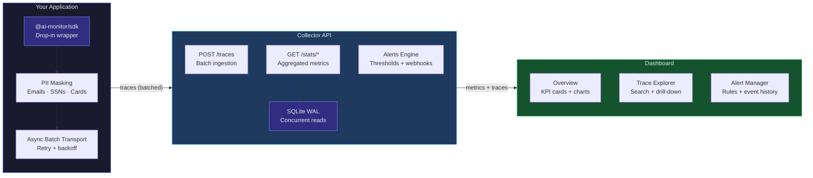

# AI Service Monitor

Production monitoring and observability platform for AI/LLM services. Tracks latency, token usage, cost, errors, and response quality across OpenAI, Anthropic, and custom model providers.


<!-- Screenshots -->
<!--  -->
<!--  -->

## Features

- **Lightweight SDK** — Drop-in wrapper for OpenAI and Anthropic SDK calls with zero overhead to AI requests
- **Automatic Telemetry** — Captures latency, token counts, cost estimates, and error details without code changes
- **PII Masking** — Built-in detection and redaction of emails, phone numbers, SSNs, and credit card numbers
- **Trace Propagation** — Correlate multi-step agent flows with trace IDs and parent span references
- **Real-time Dashboard** — Overview metrics, latency charts, cost analytics, model comparison, and error logs
- **Configurable Alerts** — Set thresholds on latency, error rate, cost, or token usage with webhook notifications
- **Data Retention** — Automatic cleanup of old telemetry data with configurable retention periods
- **Docker Ready** — Full Docker Compose setup with health checks for production deployment

## Architecture



### Monorepo Structure

```
ai-service-monitor/
├── packages/
│   ├── sdk/          # @ai-monitor/sdk — monitoring wrapper
│   ├── server/       # @ai-monitor/server — collector API
│   └── dashboard/    # @ai-monitor/dashboard — React UI
├── docker-compose.yml
├── Dockerfile        # Multi-stage: server + dashboard images
└── .github/workflows/ci.yml
```

## Tech Stack

| Layer | Technology |
|-------|-----------|
| SDK | TypeScript, async batching transport |
| API Server | Hono, better-sqlite3 (WAL mode), Zod validation |
| Dashboard | React 19, Vite 6, Tailwind CSS v4, Recharts |
| Testing | Vitest |
| Infrastructure | Docker, Docker Compose, GitHub Actions |

## Quick Start

### Prerequisites

- Node.js >= 20
- npm >= 10

### Installation

```bash
git clone https://github.com/gcasti256/ai-service-monitor.git
cd ai-service-monitor
npm install
```

### Development

```bash
# Start both server and dashboard
npm run dev

# Or start individually
npm run dev:server    # API on http://localhost:3100
npm run dev:dashboard # UI on http://localhost:5173
```

### Seed Demo Data

```bash
cd packages/server
npx tsx src/seed.ts
```

This generates 600+ traces over the last 7 days with realistic data across multiple models.

## SDK Usage

```typescript
import { AIMonitor } from '@ai-monitor/sdk';
import OpenAI from 'openai';

const monitor = new AIMonitor({
  collectorUrl: 'http://localhost:3100',
  enablePiiMasking: true,
});

const openai = new OpenAI();

// Wrap any AI call with monitoring
const response = await monitor.traceOpenAI('gpt-4o', async () => {
  return openai.chat.completions.create({
    model: 'gpt-4o',
    messages: [{ role: 'user', content: 'Hello' }],
  });
});

// For multi-step agent flows, propagate trace IDs
const traceId = crypto.randomUUID();

const step1 = await monitor.trace('openai', 'gpt-4o', '/chat/completions',
  () => openai.chat.completions.create({ model: 'gpt-4o', messages: [...] }),
  { traceId }
);

const step2 = await monitor.trace('anthropic', 'claude-sonnet-4-20250514', '/messages',
  () => anthropic.messages.create({ model: 'claude-sonnet-4-20250514', messages: [...] }),
  { traceId, parentSpanId: step1.id }
);

// Graceful shutdown
await monitor.shutdown();
```

## API Endpoints

| Method | Path | Description |
|--------|------|-------------|
| `GET` | `/health` | Health check with liveness probe |
| `POST` | `/traces` | Ingest single trace or batch (array) |
| `GET` | `/traces` | List traces with filters |
| `GET` | `/traces/:id` | Get trace by ID |
| `GET` | `/traces/by-trace/:traceId` | Get all spans in a trace group |
| `GET` | `/stats` | Aggregate dashboard metrics |
| `GET` | `/stats/latency` | Hourly latency timeseries |
| `GET` | `/stats/models` | Per-model breakdown |
| `GET` | `/stats/cost` | Daily cost timeseries |
| `GET` | `/stats/errors` | Error log with details |
| `GET` | `/alerts/rules` | List alert rules |
| `POST` | `/alerts/rules` | Create alert rule |
| `PUT` | `/alerts/rules/:id` | Update alert rule |
| `DELETE` | `/alerts/rules/:id` | Delete alert rule |
| `POST` | `/alerts/evaluate` | Evaluate all active rules |
| `GET` | `/alerts/events` | Alert event history |
| `GET` | `/admin/stats` | Database statistics |
| `POST` | `/admin/cleanup` | Trigger retention cleanup |

## Docker Deployment

```bash
# Build and start all services
docker compose up -d

# Dashboard: http://localhost:8080
# API: http://localhost:3100
```

### Kubernetes

The Docker images include health checks compatible with Kubernetes probes:

```yaml
livenessProbe:
  httpGet:
    path: /health
    port: 3100
  initialDelaySeconds: 5
  periodSeconds: 30

readinessProbe:
  httpGet:
    path: /health
    port: 3100
  initialDelaySeconds: 3
  periodSeconds: 10
```

## Configuration

| Variable | Default | Description |
|----------|---------|-------------|
| `PORT` | `3100` | Server port |
| `HOST` | `0.0.0.0` | Server bind address |
| `DATABASE_PATH` | `./data/monitor.db` | SQLite database path |
| `RETENTION_DAYS` | `30` | Auto-cleanup threshold |
| `ALERT_WEBHOOK_URLS` | — | Comma-separated webhook URLs |
| `VITE_API_URL` | `http://localhost:3100` | Dashboard API base URL |
| `API_KEY` | — | Optional API authentication |

## Production at Scale

ai-service-monitor is designed as a reference architecture for LLM observability. Here's how each layer maps to enterprise infrastructure:

| Component | Development | Production at Scale |
|-----------|------------|-------------------|
| **Collector API** | Single Hono process + SQLite | Horizontally scaled behind ALB, write to TimescaleDB or ClickHouse |
| **Storage** | SQLite WAL (single node) | TimescaleDB for time-series queries at billion-row scale, or ClickHouse for analytics |
| **SDK Transport** | Async batched fetch | SDK ships as an npm package; batch size and flush interval tuned per-service |
| **Alerting** | Webhook POST | Integration with PagerDuty, OpsGenie, Slack via alert webhooks |
| **Dashboard** | React SPA polling | Grafana dashboards powered by the same collector API, or embedded analytics |
| **Retention** | Configurable days | Tiered storage: hot (7d in TimescaleDB) → warm (90d compressed) → cold (S3 Parquet) |

### Why This Matters in Financial Services

LLM observability in regulated environments isn't optional — it's a compliance requirement:

- **Cost Governance** — Per-model cost tracking with daily aggregation enables finance teams to allocate AI spend by department, project, or use case. Alert thresholds prevent budget overruns before they happen.
- **PII Protection** — The SDK masks sensitive data (emails, SSNs, credit card numbers) *before* it leaves the application boundary. No PII in your observability pipeline means no compliance exposure.
- **Audit Trail** — Every LLM call is recorded with full trace context: model, provider, tokens, latency, cost, and error details. Trace propagation links multi-step agent flows into a single auditable chain.
- **Model Risk Management** — Error rate tracking, latency degradation alerts, and per-model comparison metrics provide the quantitative evidence that SR 11-7 model risk frameworks require.

## Testing

```bash
# Run all tests
npm test

# Watch mode
npm run test:watch

# Type check
npm run typecheck
```

## License

MIT
